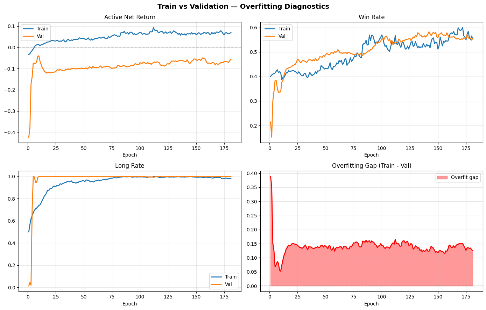

# Gap-Alpha PPO — Reinforcement Learning for Event-Driven Trade Execution

> **Deployment status:** This model is actively used in live trading. The full source code and data pipeline remain private. This document describes the system architecture, methodology, and engineering decisions in full technical detail.

---

## Overview

This project applies **Proximal Policy Optimization (PPO)** to the problem of optimally executing trades triggered by opening price gaps in equities. The system learns a **stochastic policy** over three interacting decisions simultaneously:

- **Direction** — Long, Short, or Skip (do not trade)
- **Stop-loss multiplier** — how far from entry to place the stop, relative to the gap magnitude
- **Take-profit multiplier** — how far to target, relative to the gap magnitude

The agent trains on a historical dataset of gap events across hundreds of equities and learns to generalize entry conditions, market regimes, and risk/reward sizing jointly.

---

## Pipeline Architecture

The system is divided into four sequentially-executed notebooks:

```
01_feature_engineering.ipynb     — Gap event detection + trailing technical feature construction
02_dataset_preparation.ipynb     — Train/Val/Test split, covariate shift analysis, z-scoring
03_ppo_training.ipynb            — PolicyNet architecture + full PPO training loop
04_model_validation.ipynb        — Deterministic evaluation of saved checkpoints across all splits
```

**Notebooks 02 and 03 contain the core ML contributions and are described in depth below.**

---

## Notebook 01 — Feature Engineering

Reads a wide-format daily OHLCV dataset, identifies gap events above a fixed absolute threshold, and computes a set of trailing technical features for each event. All features are computed strictly from information available at market open on the gap day — no lookahead bias is possible by construction.

Feature families span momentum, volatility, volume, and market context. A deliberate emphasis is placed on **regime-invariant** formulations: where possible, absolute indicators are normalized against their own longer-term baseline. This prevents the model from memorizing vol or momentum levels that are specific to a particular market regime.

---

## Notebook 02 — Dataset Preparation & Scaling

The **data integrity layer** — ensures nothing entering the neural network is contaminated by future information, distribution drift, or numerical instability.

### Chronological Train / Val / Test Split

Data is split strictly by **unique trading date**, never by row count, to prevent temporal leakage.

```
Train  →  earliest ~60% of dates
Val    →  middle    ~20% of dates
Test   →  latest    ~20% of dates
```

The final 250 trading days are reserved as an *exit bleed buffer* — trades entered near the dataset boundary need forward bars to resolve. Including them in any evaluation split would silently corrupt the statistics.

Features are re-merged at the **entry date** rather than the gap date, ensuring that delayed entries always see the correct market state at the time of execution.

### Covariate Shift Detection (KS Test)

Every candidate feature is subjected to a two-sample Kolmogorov-Smirnov test comparing the training distribution to the validation distribution before anything reaches the model.

| KS statistic | Verdict |
|---|---|
| < 0.05 | SAFE |
| 0.05 – 0.10 | MILD |
| > 0.10 | **DANGEROUS — auto-excluded** |

Features that shift too much between regimes are automatically removed. Only features that remain structurally stable across the train/val temporal boundary are admitted to training.

### Imputation and Z-Score Normalization

- Mean and standard deviation computed **on the training set only**, applied identically to val and test
- Ratio features clamped at the training 99.9th percentile before normalization to prevent `inf` → `NaN` cascades
- Missing values filled with the per-feature training median
- Duplicate entries per gap event sampled randomly rather than always keeping the earliest, avoiding systematic fill-speed bias

The final output is a set of `.npy` arrays and a matching simulation metadata DataFrame per split. **Row `i` in `X_train_num.npy` corresponds exactly to row `i` in `sim_train_df`** — strict alignment that allows the Numba simulator to retrieve the correct price history for each network output.

---

## Notebook 03 — PPO Training

### The RL Framing

This is not a supervised learning problem because there is no correct label for "optimal stop-loss multiplier." The reward is only revealed after simulating the trade outcome through future price bars. This makes it a natural fit for reinforcement learning, where the agent learns from the outcomes of its own sampled decisions.

The policy is **offline-batch** — rather than interacting with a live environment step-by-step, it simulates a batch of historical trades in parallel using Numba-accelerated price scanning, computes rewards, and uses those rewards to update the policy.

### Policy Network Architecture (`PolicyNet`)

A shared MLP backbone feeds into four separate output heads:

```python
backbone:         Linear(n_features, 48) → ReLU → Dropout(0.3)
                  → Linear(48, 48) → ReLU → Dropout(0.3)

action_head:      Linear(48, 3)      # logits for Skip / Long / Short
stop_mu_head:     Linear(48, 1)      # LogNormal mean for stop multiplier
stop_logstd_head: Linear(48, 1)      # LogNormal log-std for stop multiplier
take_mu_head:     Linear(48, 1)      # LogNormal mean for take multiplier
take_logstd_head: Linear(48, 1)      # LogNormal log-std for take multiplier
```

The continuous heads use a **LogNormal distribution** — stop and take multipliers must be strictly positive, and LogNormal guarantees this by construction. The network outputs `mu` and `log_sigma`, and a sample is drawn from `LogNormal(mu, exp(log_sigma))`.

All continuous head outputs are **tanh-squashed to `[-2, 2]`** before being used as distribution parameters. Unconstrained, `mu` and `log_sigma` can diverge early in training, causing gradient explosions through the log-probability computation. Squashing keeps the implied distribution ranges physically meaningful throughout.

**Initialization strategy:** All logit and log-std heads are initialized with orthogonal weights at gain `0.01`. This starts the policy in near-maximum-entropy state — the agent explores roughly uniformly before committing. The `stop_mu` and `take_mu` biases are set to produce initial multipliers of approximately `1.6×` and `2.7×` gap distance respectively, giving the model a reasonable starting prior.

### Unified Skip/Long/Short Action

A key design decision is collapsing the "trade vs. skip" and "direction" decisions into a **single 3-way categorical action** rather than two separate binary decisions. This allows the model to learn correlations between direction confidence and trade-rate naturally, rather than having the direction head produce outputs that never influence the skip gate's gradient.

### Numba Trade Simulator

The environment simulation is a bar-by-bar forward scan written in `@nb.njit`, compiled by Numba for CPU-native execution. For each trade, it iterates over future OHLC bars and checks:

1. Did the bar **open** beyond the stop or take? (gap-open execution)
2. Did the bar's **high** reach the take-profit?
3. Did the bar's **low** reach the stop-loss?
4. If both hit the same bar: resolve to whichever was closer to the prior open.
5. If neither hits within `MAX_HOLD_DAYS`: close at the final bar's close (time-stop).

This matches real-world trade mechanics with day-bar precision — a key fidelity requirement when the gap magnitude itself is the unit of risk sizing.

The searchsorted lookup inside the Numba kernel is implemented as a manual binary search (while-loop arithmetic) rather than calling `np.searchsorted`. This eliminates any Python/NumPy interop inside the hot loop, which would otherwise prevent Numba from fully compiling the function.

**Flattened contiguous price database.** Rather than storing prices in a Python dict of per-ticker NumPy arrays, the entire price history across all tickers is pre-flattened into five contiguous 1-D arrays (`bar_idx`, `open`, `high`, `low`, `close`) alongside a `ticker_offsets` index array. Each ticker's data occupies a known contiguous slice `[offsets[i] : offsets[i+1]]`. This layout is cache-friendly — the Numba kernel accesses a single sequential memory region per trade rather than chasing pointers into separate arrays.

**Fully parallel batch simulation.** The outer loop over trades in a batch uses `nb.prange` inside a `@nb.njit(parallel=True)` kernel, dispatching all N trades across available CPU threads simultaneously via Numba's OpenMP backend. Each thread independently processes its assigned trade (no shared mutable state), so the simulation scales linearly with core count. The Numba kernel is warmed up with a dummy call at startup to force JIT compilation before the first training epoch begins.

**Pre-computed simulation arrays.** All per-row metadata required by the simulator — ticker integer IDs (mapped from strings), skip-entry flags, entry prices, bar indices, gap sizes, and trigger flags — are extracted from the simulation DataFrames once at load time into typed NumPy arrays. During each batch, the pre-computed arrays are indexed with `idxb_list` (a single NumPy fancy-index) rather than calling `sim_df.iloc[idxb_list]` on every batch. This eliminates repeated pandas indexing overhead inside the training loop.

**Vectorized stop/take price and reward computation.** Stop and take prices for all trades in a batch are computed simultaneously using NumPy `np.where` operations before entering the Numba kernel. Similarly, the reward function — including the transaction cost deduction, per-day holding penalty, and multiplier excess penalty — is applied entirely via NumPy boolean masks and vectorized arithmetic after the simulation returns, replacing a Python for-loop over batch items.

### Reward Function

The reward balances three competing objectives, applied after the trade resolves:

- **Gross return** of the executed trade (direction-adjusted percentage P&L)
- **Transaction cost proxy** — a fixed deduction per executed trade to penalize overtrading
- **Holding time penalty** — a per-day cost that scales with duration, incentivizing the model to prefer trades that resolve quickly

A multiplier penalty discourages extreme stop/take values: if the model samples multipliers beyond a practical ceiling, a log-excess penalty is added. This prevents the policy from "learning" that extremely wide stops are a free lunch in the simulator.

A **low trade-rate penalty** prevents policy collapse into "always skip" — if the batch trade rate drops below a minimum threshold, every skip action receives a negative signal proportional to how far below the threshold the rate fell.

### Entropy Coverage Bonus

Standard entropy bonuses for LogNormal distributions can be gamed by the model collapsing to a bimodal distribution (always min or always max multipliers), which technically has high entropy but low diversity. Instead, a **differentiable coverage entropy** is computed:

1. Bin the batch's `mu` values into 8 soft bins via Gaussian kernels
2. Compute the Shannon entropy of the resulting soft histogram
3. Reward this as a bonus — maximized only when multipliers spread uniformly across the full range

This forces genuine exploration across the multiplier space, not just high variance around two extremes.

### PPO Two-Phase Loop

Training strictly separates collection and optimization into two non-overlapping phases per epoch:

**Phase 1 — Collection** (`collect_rollout`)
- Model runs in `eval()` mode with `torch.no_grad()`
- Actions are sampled stochastically from current policy
- For each batch: trade simulation executes, rewards computed, `old_log_probs` stored
- Gaussian noise (`σ = 0.22`) is injected into the feature inputs during collection only, acting as data augmentation and regularization

**Phase 2 — PPO Update Passes** (`ppo_update_pass`)
- Model runs in `train()` mode; simulation does **not** re-execute
- The stored actions from Phase 1 are re-evaluated under the current policy
- The PPO clipped surrogate loss bounds the update magnitude:

```
ratio    = exp(log_π_new - log_π_old)
surr1    = ratio × advantage
surr2    = clip(ratio, 1 - ε, 1 + ε) × advantage
loss     = -mean(min(surr1, surr2))
         - entropy_coef_action × H_action
         - entropy_coef_stops  × H_stops
```

Gradient norms are clipped to `max_norm = 1.0` before every optimizer step.

**Global advantage normalization** is applied across the full epoch's rollout buffer before any update pass, ensuring advantages have zero mean and unit variance regardless of the reward scale for that epoch.

### Curriculum Learning (Entropy Annealing)

Entropy coefficients and the holding-time penalty both anneal linearly over the first 100 epochs:

| Parameter | Start | End |
|---|---|---|
| `entropy_coef_action` | 0.05 | 0.02 |
| `entropy_coef_stops` | 0.02 | 0.005 |
| `daily_penalty` | 0.001 | 0.004 |

Early training: high entropy bonuses force exploration of the full action space; low holding penalty allows the model to take longer-duration trades while it learns. Late training: the model is pushed to commit to tighter multipliers and more time-efficient trades.

### Stratified Training Sampler

The dataset contains multiple candidate entries per gap event (different entry conditions evaluated against the same gap). If the DataLoader samples naively, the same gap event can appear multiple times in one epoch with different entry prices, creating implicit correlation within mini-batches.

`EpochGapSampler` groups all row indices by `(ticker, Date)` and selects exactly **one random entry per gap event per epoch**. This ensures:
- Each unique gap event contributes exactly once per epoch
- The sampled entry type varies between epochs, preventing the model from overfitting to a specific execution condition

### Checkpointing and Early Stopping

- Model is checkpointed only after a warmup period (epoch ≥ 25) to avoid saving an undertrained policy
- Checkpoint criterion: best validation `active_net_return` above the previous best, subject to a minimum trade-rate threshold (prevents checkpointing a "never trade" policy that scores zero loss)
- Early stopping with patience of 25 epochs — training halts if validation performance does not improve

---

## Notebook 04 — Model Validation

Loads a named checkpoint and runs deterministic (greedy) evaluation across all three splits. Key differences from training:
- No noise injection
- No action sampling — the `argmax` of action logits is taken directly; `exp(mu)` is used as the multiplier without sampling
- A full trade log is emitted with entry/exit prices, multipliers, probabilities, holding duration, and P&L for every executed trade across all splits

The three-split comparison table gives an immediate readout of train/val/test generalization gap.

---

## Training Diagnostics



The training curves show stable convergence across 180 epochs. Win rate on both train and validation climbs steadily and converges to similar levels by the end of training, suggesting the directional signal generalizes. The overfitting gap (Train − Val active net return) spikes sharply in the first few epochs as the policy begins to specialize, then stabilizes at a consistent level for the remainder of training — indicating the model is not continuing to overfit but rather reflecting a persistent structural difference between the two periods.

---

## Evaluation Results

Greedy (deterministic) evaluation of the final checkpoint across all three splits:

| Metric | Train | Validation | Test |
|---|---|---|---|
| Trades Executed | 67,195 | 8,170 | 3,171 |
| Trade Rate | 5.18% | 1.57% | 0.72% |
| Win Rate | 78.71% | 56.93% | 58.15% |
| Mean Gross Return | 23.49% | 4.09% | 11.20% |
| Mean Trade Duration | 21.6 days | 20.5 days | 31.1 days |
| **Gross Return / Day** | **~1.09%** | **~0.20%** | **~0.36%** |

Gross return is positive across all three splits, including the blind test set. The key efficiency metric is **gross return per day held** — normalizing by trade duration removes the effect of hold time and gives a cleaner read of edge quality per unit of capital deployment. Val and test both show meaningful per-day returns on genuinely out-of-sample data.

The *mean net return* column is omitted here intentionally — net return in this system includes an intra-reward holding time penalty used to train the model toward time-efficient exits. It is an optimization signal, not a P&L figure, and is not meaningful as a standalone performance metric.

The model converged to a long-only strategy across all splits, reflecting the directional bias present in the training data during the covered period.

> **A note on the train/val gap:** The train and validation sets span materially different market regimes. The training period covers a predominantly trending market environment, while the validation and test periods include distinct volatility and regime characteristics. A significant portion of the performance gap reflects this regime shift rather than classical overfitting — a known and expected challenge in any system trained on historical financial data. The positive gross return per day on both held-out splits confirms that the core directional signal survives out-of-sample.

---

## Key Engineering Decisions

| Decision | Rationale |
|---|---|
| Regime-invariant feature formulation | Prevents the model from memorizing indicator levels specific to a single market regime |
| KS-based automated feature exclusion | Removes features that shift too much between train and val before they can contaminate the model |
| Entry-date feature re-merge | Ensures delayed entries see the correct market state at execution time, not the stale gap-day state |
| Chronological split by unique date | Prevents any temporal leakage from row-count-based splitting |
| LogNormal action heads | Multipliers must be strictly positive; Normal distribution would require post-hoc clamping with gradient discontinuities |
| Unified 3-way categorical action | Correlates direction confidence with trade-rate through a single gradient path |
| Flattened contiguous price DB | Single sequential memory region per trade; avoids pointer chasing through per-ticker dict structures |
| Parallel Numba batch simulator | `nb.prange` dispatches all trades in a batch across CPU threads simultaneously; simulation scales with core count |
| Pre-computed simulation arrays | All per-row metadata converted to typed NumPy arrays once at startup; eliminates `df.iloc[]` overhead inside the training loop |
| Vectorized stop/take and reward computation | NumPy boolean masks and `np.where` replace Python for-loops over batch items |
| Manual binary search inside Numba | Avoids `np.searchsorted` interop inside the JIT kernel, implemented as while-loop arithmetic |
| Numba warm-up call | Forces JIT compilation at startup, eliminating first-epoch latency |
| Coverage entropy bonus | Prevents bimodal multiplier collapse that defeats standard entropy regularization |
| Global advantage normalization | Decouples reward scale from gradient magnitude across epochs |
| EpochGapSampler | Removes within-batch correlation from multiple entries of the same gap event |
| Stochastic collection, greedy evaluation | Clean separation: exploration during learning, determinism during evaluation |

---

## Stack

`Python` · `PyTorch` · `Numba` · `pandas` · `NumPy` · `SciPy` · `scikit-learn`

---

## Project Status

The model described here is deployed in live trading. The repository containing training code, data pipelines, and model weights is **private**. This document exists to describe the technical work in detail for the purpose of professional review.

*Full code access available upon request for verified employers during technical interviews.*
